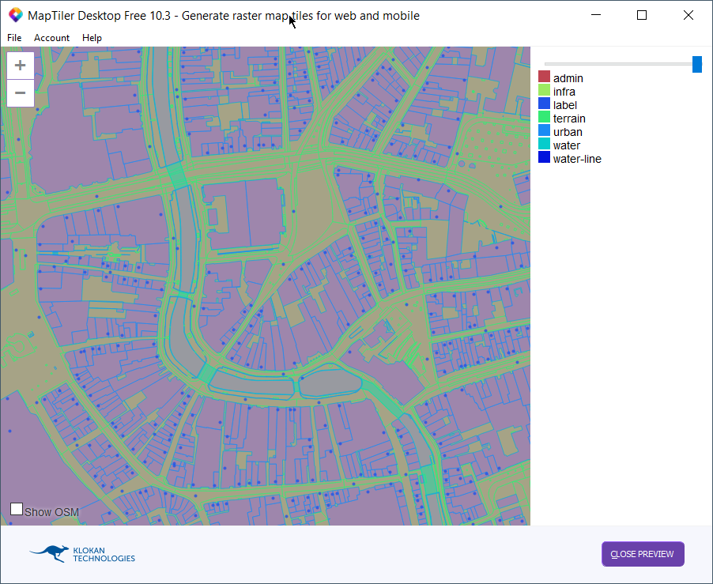

# pdok

MBTile files containing PDOK vector Tiles BRT en BGT for sample cities.

Note: The vector tiles have been generated once for evaluation purposes and are not updated.

Source vector tiles: https://geodata.nationaalgeoregister.nl/beta/topotiles-viewer/#8/52.33/5.19

GitHub vector tiles: https://github.com/PDOK/vectortiles-bgt-brt

Cities available: 

[Utrecht](mbtiles/utrecht.mbtiles) 

[Maastricht](mbtiles/maastricht.mbtiles)

[The Hague](mbtiles/thehague.mbtiles)

[Amsterdam](mbtiles/amsterdam.mbtiles) 

[Rotterdam](mbtiles/rotterdam.mbtiles) 

## Desktop viewer

Install MapTiler desktop https://www.maptiler.com/desktop/ and open MBTile file to visualize



## Unpack MBTiles

To unpack the MBTiles file you can use the command <A href="https://github.com/mapbox/mbutil">mb-util</a> as follows:

```
$ mb-util amsterdam.mbtiles tiles --image_format=pbf

```

## Offline Sample viewer

To run offline sample viewer with vector tiles:

1] Copy mbtiles file to the samples directy

2] Unpack MBTiles

Sample for Amsterdam:

```
$ mb-util amsterdam.mbtiles tiles --image_format=pbf
```

3] run webserver

for example run <a href="https://caddyserver.com/">caddy server</a>

```
$ caddy
Activating privacy features... done.
http://:2015
```

4] View in browser

Go to http://localhost:2015/index.html to view the site 
